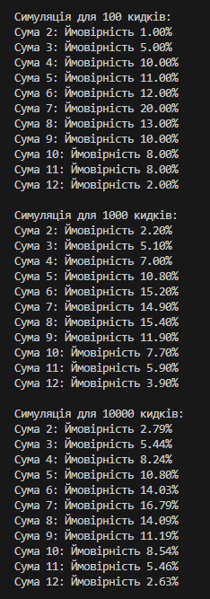
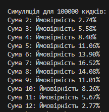
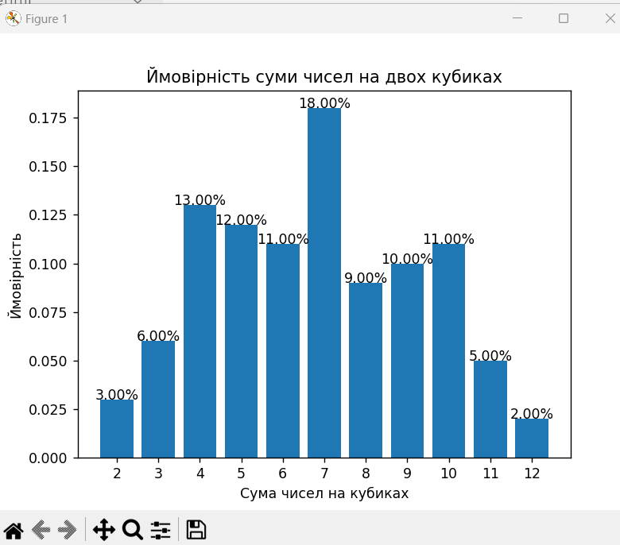
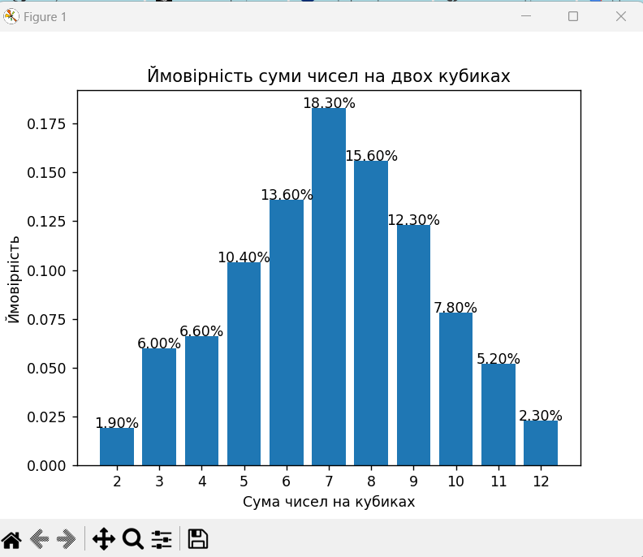
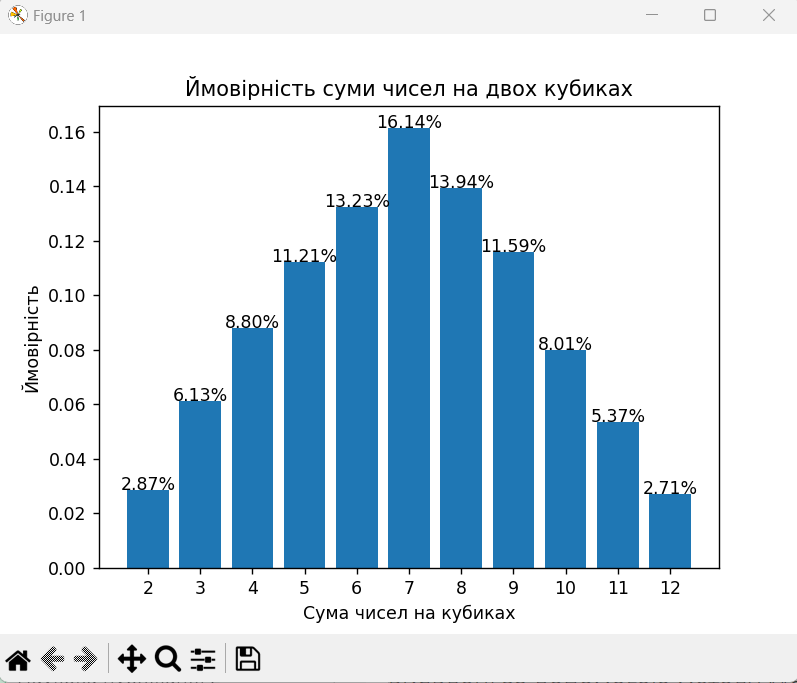
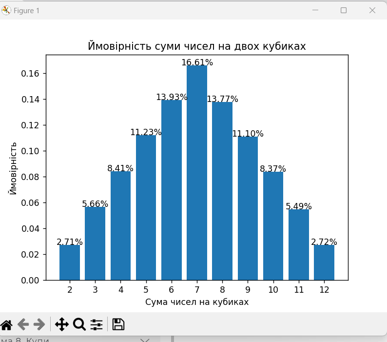

# goit-algo-fp

Task 7

Результати симуляцій методом Монте-Карло:
100 кидків: Випадковість призводить до значних відхилень від аналітичних значень через малу кількість кидків.
1000 кидків: Результати починають наближатися до аналітичних значень, але все ще є деякі значні відхилення.
10000 кидків: Результати стають більш стабільними і вже значно ближчі до аналітичних значень.
100000 кидків: Результати майже точно відповідають аналітичним значенням, з лише незначними відхиленнями, що є нормальним для методу Монте-Карло.

Порівняння:
Сума 2:
Аналітична ймовірність: 2.78%
Ймовірність при 100000 кидках: 2.71%
Відхилення дуже маленьке, симуляція майже точно відображає аналітичний результат.

Сума 7:
Аналітична ймовірність: 16.67%
Ймовірність при 100000 кидках: 16.61%
Ця сума має найвищу ймовірність, і симуляція дуже точно відображає це.

Сума 12:
Аналітична ймовірність: 2.78%
Ймовірність при 100000 кидках: 2.72%
Як і з сумою 2, симуляція дуже близька до аналітичного значення.

Висновок:
Метод Монте-Карло показує чудові результати, коли кількість кидків є досить великою (наприклад, 100000). Для меншої кількості кидків результати можуть значно відхилятися через випадковість. Однак зі збільшенням кількості симуляцій ймовірності, отримані методом Монте-Карло, збігаються з аналітичними розрахунками. Це підтверджує, що метод Монте-Карло є ефективним для оцінки ймовірностей, якщо використовується достатня кількість ітерацій.
